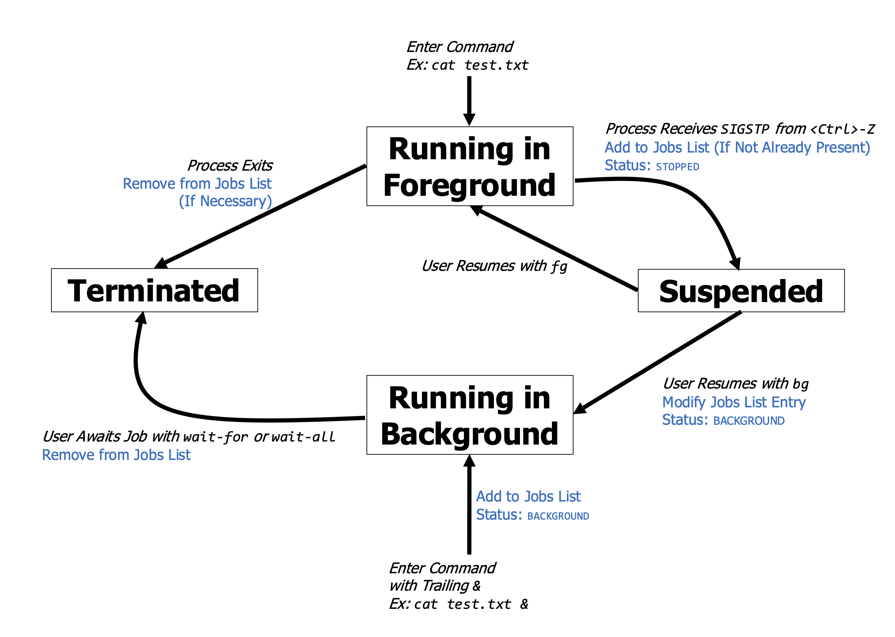

# CSCI 4061 -- Project 1: `swish`

> Archived from the Canvas assignment page
> <https://canvas.umn.edu/courses/579183/assignments/5424522>
>
> | | |
> |---|---|
> | **Due** | Fri Oct 2, 2026 11:59pm |
> | **Points** | 100 |
> | **Available** | Sep 14, 2026 12:00am - Oct 2, 2026 11:59pm |

---

#### Due Dates

- Project Quiz: 11:59pm, Friday 09/18/26 (Canvas)
- Final Submission: 11:59pm, Friday 10/02/26 (Gradescope)

**6.25%** of Course Grade

Projects are to be completed **individually or with a partner. Collaboration outside of your project team is prohibited.** See our [syllabus](https://canvas.umn.edu/courses/579183/assignments/syllabus) for full academic integrity policies.

**Starter Code:** [proj1-code.zip](https://csci4061-fa26.s3.amazonaws.com/proj1-code.zip)

Download and unpack the starter code linked above. Place the unpacked `proj1-code` directory *inside* of your existing `csci4061-fa26` directory to ensure you can access the project code within your Docker environment.

## Introduction

This project will involve extensive use of system calls, specifically those for process creation, process management, I/O, and signal handling. While a single system call by itself is not always interesting, the real challenge and excitement of systems programming is in combining system calls to build useful and powerful tools. We will be building such a tool, the Simple Working Implementation Shell (`swish`), in this project.

Whenever you are using a terminal program, you are really interacting with a shell process. Command-line shells allow one access to the capabilities of a computer using simple, interactive means. Type the name of a program and the shell will bring it to life as a new process, run it, and show output. Familiarizing yourself with the inner workings of shells will give you a chance to appreciate how system calls can be usefully combined and will make you a more effective command-line user.

The goal of this project is to write a simplified command-line shell called `swish`. This shell will be less functional in many ways from standard shells like `bash` (the default on most Linux machines), but will still have some useful features.

This project will cover a number of important systems programming topics:

- String tokenization using `strtok()`
- Getting and setting the current working directory with `getcwd()` and `chdir()`
- Program execution using `fork()`, `exec()`, and `wait()`
- Child process management using `wait()` and `waitpid()`
- Input and output redirection with `open()` and `dup2()`
- Signal handling using `setpgid()`, `tcsetpgrp()`, and `sigaction()`
- Managing foreground and background job execution using signals and `kill()`

## Grading Criteria

- **Project Quiz (10%):** We have posted a quiz about this assignment description on our class Canvas site. Complete the quiz by the due date. The quiz is to be completed **individually** but multiple attempts are allowed.
- **Automated Testing (40%):** We have provided several tests along with instructions on how to run these tests from the command line. To pass the tests, you will need to ensure that your code compiles and runs according to the specifications given.
- **Oral Exam (40%):** Shortly after the project due date, you will sign up for a brief oral exam with the TAs, who will ask you questions about your submitted code and the extent to which you understand your work. Oral exams will be done individually, not together with your project partner if you choose to work with one.
- **Error Checking (10%):** TAs will manually review your code to evaluate the extent to which your code thoroughly and appropriately checks for and handles error conditions. **Make sure that you properly check for and deal with errors whenever using a C library function that may indicate an error with its return value.**

### Makefile

A `Makefile` is provided as part of this project, much like you have seen for the lab assignments. This file supports the following commands:

- `make`: Compile all code, produce an executable `swish` program.
- `make clean`: Remove all compiled items. Useful if you want to recompile everything from scratch.
- `make clean-tests`: Remove all files produced during execution of the tests.
- `make zip`: Create a zip file for submission to Gradescope
- `make test`: Run all test cases
- `make test testnum=5`: Run test case \#5 only

### Automated Tests

Automated tests are included with the project's starter code. **These tests are known to work in the 4061 Docker container only** but in most cases they should run identically in Linux environments such as the CSE Lab machines.

*Don't depend on the test cases and their output for your debugging.* Know how to run the `swish` program directly from the command line, and be ready to use tools like `gdb` to unearth the source of problems you encounter.

Additionally, we have not provided tests for everything you will be expected to implement as part of this project. You will need to do some of your own testing to verify that your implementation of these features works as expected, and we will be running our own tests against these features as well when grading your submission.

### Error Checking Criteria

To earn full points for a task, your relevant code must check all necessary return values and print informative messages if an error occurs. Your code should also release/close all allocated resources on all possible error paths. -1 point per missed check or cleanup step.

- **Task 0:** 2 points
- **Task 1:** 4 points
- **Task 2:** 4 points
- **Task 3:** 4 points
- **Task 4:** 4 points
- **Task 5:** 4 points
- **Task 6:** 4 points

## Starter Code

|     **File**      | **Purpose** | **Notes**                                                           |
|:-----------------:|:-----------:|:--------------------------------------------------------------------|
|    `Makefile`     |    Build    | Build file to compile and run test cases                            |
| `string_vector.h` |  Provided   | Header file for a vector data structure to store strings            |
| `string_vector.c` |  Provided   | Implementation of the string vector data structure                  |
|   `job_list.h`    |  Provided   | Header file for a linked list data structure to store terminal jobs |
|   `job_list.c`    |  Provided   | Implementation of the linked list data structure for terminal jobs  |
|     `swish.c`     | ***EDIT***  | Implements the command-line interface for the `swish` shell.        |
|  `swish_funcs.h`  |  Provided   | Header file for `swish` helper functions                            |
|  `swish_funcs.c`  | ***EDIT***  | Implementations of `swish` helper functions                         |
|   `test_cases/`   |   Testing   | Test cases and related materials                                    |

**Note that you are only allowed to change the files marked as *EDIT* above. For all other files, the Gradescope autograder will ignore any modifications you make and use the standard version provided with the starter code.**

## Task 0: String Tokenization

One of the most important tasks of any shell is to break user input into *tokens* - essentially substrings separated by whitespace. For example, the string `ls -l -a` consists of three tokens: `ls`, `-l` and `-a`.

Your first task is to complete the `tokenize()` function defined in `swish_funcs.c`. You should use the `strtok()` function to parse the string passed in as the first argument. The `tokenize()` function should populate the `strvec_t` instance pointed to by the second function argument.

A `strvec_t` is a vector (basically a resizable array) of string items. Your job in this function is to add each token to the specified vector. So, for example if the string `ls -l -a` were the first argument to `tokenize()`, then the vector should contain `ls`, `-l` and `-a` as its elements after the function completes.

You may assume the user's input always consists of words separated by single spaces in this project.

**Take the time to read and understand the string vector API defined in `string_vector.h`. This is the main data structure for storing and executing commands, and it has many useful features that you will need to complete several parts of the this project.**

## Task 1: Working Directory Management

The `main()` function in `swish.c` is built around a simple loop: read a line from standard input, tokenize it, and then perform some operation based on the contents of this line. If certain tokens are present at the beginning of this line, your shell should perform built-in operations. Otherwise, it will default to running a new program whose name is specified by the first token.

You should start by implementing two built-in operations in `swish.c`: `pwd` and `cd`.

If the user types in `pwd`, your shell should print the current working directory (using the `getcwd()` system call). If successful, `pwd` will print out the current working directory followed by a newline. You may assume that the directory pathname returned by `getcwd()` is no longer than `CMD_LEN` characters (including the null terminator).

If an error occurs on the call to `getcwd()`, use `perror("getcwd")` to generate an error message.

If the user types in `cd`, the shell should change the current working directory (using the `chdir()` system call). `cd` may take a single argument (which will be the second token parsed from the input): the directory to change to. However, if no second argument is provided (i.e., the user simply types in `cd` and hits enter) then the shell should change to the user's home directory by default. This directory is defined in the `HOME` environment variable, and you will need to use `getenv()` to look up the value of this variable.

If successful, `cd` will change the current working directory and print no output. If an error occurs on the call to `chdir()`, use `perror("chdir")` to generate an error message.

In general, you should follow the convention shown for `getcwd()` and `chdir()` above for printing error messages in this project unless stated otherwise.

### Error Handling Strategy

In most of the programs we have seen so far, when an error occurs, we have taken steps to print an error message, clean up, and return an error value from `main()`. In a shell process, when a user command fails, we want to gracefully handle the user command failure but keep the shell process running to prompt the user for the next command.

Instead of returning a failure from `main()`, the shell process should print an error message to the user, do any cleanup local to that user command, and then re-prompt the user for the next command. Make sure you are taking this approach when handling user command errors in the main command loop in `swish.c`. If an error occurs in the shell process unrelated to a user command, the shell process should clean up and return an error value from `main()`.

## Task 2: Running Commands

Your next job is to complete the `run_command()` function defined in `swish_funcs.c`. This function will do much of the heavy lifting to launch new programs from your shell.

When the first token from the user's input doesn't match any built-in operation (e.g., `cd`, `pwd`), your shell should take the following steps (which you should implement in the `main()` function's `while` loop):

1.  `fork()` a child process, which will then call `run_command()`.
2.  Within `run_command()`, build up the necessary arguments for the new program and use an `exec()` system call to start running that program.
3.  In the parent process, wait for the child process to terminate.

Don't forget that the first command-line argument is traditionally the name of the program itself. For example, if the user types in `ls -l -a` then the arguments for the `ls` program should be `ls`, `-l`, and `-a`.

*Hint:* We recommend you create a string array (don't forget the `NULL` sentinel at the end) within `run_command()` using the strings in the `tokens` vector passed to the function. Then you can call `execvp()`, which also gives your shell the ability to search `PATH` for programs. We have defined `MAX_ARGS` in `swish_funcs.c` which is a constant giving the maximum number of arguments that you shell is expected to be able to take in for a command. You can use this when creating your argument array to avoid `malloc()`.

*Another Hint:* While you can use either `wait()` or `waitpid()` in the parent shell process, we recommend you use `waitpid()` since you will need it for later tasks.

*One More Hint:* Be careful how you handle errors (such as a failed call to `exec()`) in the child process. As stated in the description for the `run_command()` function in the `swish_funcs.h` header file, `run_command()` should follow the `exec()` convention where it will not return if successful. If `run_command()` fails, it should return `-1`.

If `run_command()` fails and returns to the main command run loop, you should return `1` from the child process to terminate that process (we *don't* want to have two `swish` shell processes: the original and this new child process). If an error occurs on the call to `exec()`, use `perror("exec")` to generate an error message after the failure in `run_command()`. Don't print any additional error messages in the main run loop after a `run_command()` failure.

## Task 3: Redirecting Input and Output

Most shells give you the ability to redirect standard input and standard output when running a program. We will use the same syntax as `bash` for the user to request redirection in their commands to the shell. Your shell does not need to deal with redirection for built-in commands like `pwd` or `cd`, just for executed programs.

Here are a few examples:

- `ls -l > out.txt` redirects the output of `ls -l` from standard output to the file `out.txt`. That is, rather than printing to the screen, `ls` writes to the designated file. If the file already exists, it is truncated and overwritten.
- `cat < gatsby.txt` redirects input to the `cat` program from standard input to the file `gatsby.txt`. That is, rather than consuming keyboard input from the user, the program reads from the specified file.
- `ls -l >> out.txt` redirects the output of `ls -l` from standard output to the file `out.txt`. However, `out.txt` is *not* overwritten if it already exists. Rather, the output is *appended* to the end of the existing file. The file is created if it does not already exist.

You now need to extend the `run_command()` function in `swish_funcs.c` to perform input and/or output redirection. You should accomplish this by checking for the presence of strings `>`, `<`, or `>>` in the tokens passed in to this function.

Then, you will need to `open()` the specified file for reading (when the file is the target of a `<` operator), writing (when the file is the target of a `>` operator), or appending (when the file is the target of a `>>` operator). For files being opened for writing or appending, specify `S_IRUSR | S_IWUSR` as the permissions in the `mode` parameter to the `open()` call.

If an error occurs in the call to `open()` for an input redirection file, use `perror("Failed to open input file")` to generate an error message. If an error occurs on the call to `open()` for an output or append redirection file, use `perror("Failed to open output file")` to generate an error message.

On successful open(s), redirect standard input and/or standard output to the opened files using `dup2()`.

You may make the following simplifying assumptions:

- Only *one* of `>` or `>>` will be present, not both. You don't need to deal with invalid command-line input like `ls -l > out.txt >> out.txt`.
- The user will never attempt to redirect standard input from multiple files or standard output to multiple files. You don't need to deal with invalid command-line input like `ls -l > out1.txt > out2.txt`.
- All redirection-related tokens will occur *after* the program name and its arguments, never before. You don't need to deal with invalid command-line input like `ls > out.txt -l`.

Here are a few examples of valid command-line inputs featuring redirection:

- `ls -l > out.txt`
- `ls -l >> out.txt`
- `cat < gatsby.txt`
- `cat < gatsby.txt > out.txt`
- `cat < gatsby.txt >> out.txt`
- `wc -l < gatsby.txt > out.txt`

Remember, redirection operators and their operands are *not* passed as arguments to the executed program (and therefore should not be included in your arguments to `exec()`). For example, if the user were to type in `wc -l < gatsby.txt > out.txt` then you should invoke the program `wc` with the command-line arguments `wc` and `-l`, but no additional arguments.

## Task 4: Basic Signal Management

Terminals usually give the user the ability to send signals to the currently running program. You may already be familiar with the `Ctrl-C` keyboard shortcut to (hopefully) terminate the current program. What this is really doing is sending the signal `SIGINT` to the program.

It is also possible to "pause" programs to be resumed later. The keyboard shortcut `Ctrl-Z` traditionally sends the `SIGTSTP` signal to the currently running program. You will work with this signal more in Task 5.

The current version of `swish` has a problem: if you type in `Ctrl-C`, the shell process itself, rather than the currently running program, receives `SIGINT` and terminates.

We can resolve this through the concept of *foreground* and *background* process groups. Each process in a Unix-based system is given a unique process ID. Every process also possesses a (potentially non-unique) process group ID (pgid), which we can get or set using the `getpgid()` and `setpgid()` system calls. By default, a process inherits the pgid of its parent.

Furthermore, the Posix standard has defined the `tcsetpgrp()` system call designating a *foreground process group* for a terminal. The terminal is identified by a file descriptor (always `STDIN_FILENO` in this project), and the process group to put into the foreground is identified by its ID. When we use keyboard shortcuts to generate signals, those signals are always sent to members of the foreground process group.

We need to modify `swish` so that the forked child process lives in its own process group, separate from that of the parent shell process, and we need to assign this group to the foreground of the current terminal.

**You can accomplish this with the following steps:**

1.  Use `setpgid()` within the `run_command()` function to change the child process's group. You should use the child's process ID (obtained through `getpid()`) as its process group ID (it's OK for them to be the same).
2.  Modify your code that implements waiting for child processes in `main()`:
    - Call `tcsetpgrp()` from the parent process *before* waiting to put the child's process group in the foreground. The process group ID is just the child's pid, returned to the parent from `fork()`.
    - Wait for the child process, as before.
    - Call `tcsetpgrp()` from the parent process *after* waiting to restore the shell process to the foreground. You can use the parent's process ID (from `getpid()`) as the process group ID here.

Study the code involving `sigaction()` at the beginning of the `main()` function. This instructs the shell process to ignore the signals `SIGTTOU` and `SIGTTIN`, which may be delivered when it is moved to the background.

Children inherit the signal handlers of their parents, but we *do not* want processes spawned by our shell to similarly ignore `SIGTTOU` and `SIGTTIN`. Add code to `run_command()` to set the child's handlers for these two signal types back to the default.

*Hint*: You can copy most of the signal code at the beginning of main for this. However, you'll want to set the signal handler as `SIG_DFL` rather than `SIG_IGN`.

## Task 5: Dealing with Stopped Processes

Typing `Ctrl-Z` into your shell will send the `SIGTSTP` signal to the foreground process group. This will pause, but not terminate, the currently executing program. However, this will not cause a simple call to `wait()` or `waitpid()` to return as it would if the program were to exit.

To detect when a child has stopped but *not* terminated, you need to do the following (which should still deal with processes that terminate normally as well):

1.  When waiting for the child, call `waitpid()` with `WUNTRACED` as the third argument. Make sure to use the function's second argument to store status information about the child in an `int` variable.
2.  Once `waitpid()` returns, use the `WIFSTOPPED` macro with the child's status to check if the child stopped because of a signal instead of terminating.

You will need to keep track of stopped programs, or "jobs", to allow the user to resume them later.

When a program is stopped (doesn't terminate), add it to the shells job list (defined as `jobs` in `main()`). We have provided the `job_list_t` data structure for this purpose.

**Study the file `job_list.h` and understand the API for this data structure. It has several features that will make your life easier.**

You can test out your job list code with the `jobs` shell command (already implemented for you). For example, you might see the following output, indicating there are two stopped jobs (programs): `wc` and `list_main`:

``` console
@> jobs
0: wc (stopped)
1: list_main (stopped)
```

Finally, complete the `resume_job()` function in `swish_funcs.c` to enable use of the `fg` shell command. This command requires a single integer argument, specifying an index in the terminal's jobs list. Your `resume_job()` will then resume execution of the specified job in the foreground of the terminal.

For example, to resume the `wc` command identified as stopped in the output of `jobs` given above, the user would type:

``` console
@> fg 0
```

`resume_job()` should take the following steps:

1.  Parse the job's index from the second token. You can use `sscanf()` or `atoi()` for this.
2.  Look up the `job_t` for the specified job using `job_list_get()`. If the job index is out of bounds, use `fprintf(stderr, "Job index out of bounds\n")` to generate an error message. Then return a failure value from `resume_job()`.
3.  Use `tcsetpgrp()` to move the job's process group (identified by its pid) into the foreground.
4.  Use the `kill()` system call to send the process the `SIGCONT` signal, prompting it to resume its execution.
5.  Use `waitpid()` to wait for the program to terminate or be paused once again, just like we do when starting up a new program.
6.  If the program has terminated (not stopped), remove it from the jobs list.
7.  Call `tcsetpgrp()` to restore the shell process to the foreground, just like in the previous task.

Remember, we don't need to fork any new processes in this case. The process we need was previously forked when the program was first launched. All that `swish` must do here is signal the relevant process and wait for it.

## Task 6: Background Job Execution

Real shells allow you to run programs in the background. This is accomplished by creating and starting a process to execute the user's command and then immediately re-prompting the user for the next command while the previous command runs in parallel. Here, we will add support for creating background processes and cleaning up terminated background processes.

First, add logic to your code in `main()` to launch programs in the background:

1.  Check for the presence of a `&` as the last token in the user's input.
2.  If this is present, you should launch the specified program in the background rather than in the foreground as usual.
    - You will still need to `fork()` a child process.
    - However, in the background case, *do not* use `tcsetpgrp()` to move the child into the foreground.
    - Also, *do not* call `waitpid()` to wait for the child to finish.
3.  Add a new entry to the job list with the child's pid, the program name (from token `0`), and a `BACKGROUND` status value.

Next, you will need to extend your `resume_job()` function to enable the use of the `bg` terminal command. Where `fg` resumes a stopped job in the foreground, `bg` resumes a stopped job in the background.

This involves similar changes that you just made to `main()`, this time in `resume_job()`:

1.  In the background case, *do not* use `tcsetpgrp()` on the resumed process - keep it in the background.
2.  *Do not* wait for the process to be stopped or to terminate with `waitpid()`.
3.  Change the `status` value of the relevant entry in the jobs list from `STOPPED` to `BACKGROUND`.

Finally, you must finish the code for two more shell commands: `wait-for` and `wait-all`. These commands will instruct the shell process to wait for one or all background processes, respectively, to terminate (or be stopped) so that we can clean up the termination states of the background processes (if they have indeed terminated).

First, `wait-for` accepts a numerical second argument, specifying an index in the job list, and causes the shell to wait for this program to terminate or stop. For example `wait-for 0` will wait for the first job in the list.

Complete the `await_background_job()` function, which will be called from `main()` to handle the `wait-for` command:

1.  Parse the job list index from the second token.
2.  Look up the relevant `job_t` from the jobs list. Just as before in `resume_job()`, if the job index is out of bounds, use `fprintf(stderr, "Job index out of bounds\n")` to generate an error message. Then return a failure value from `await_background_job()`.
3.  Make sure the job's status is `BACKGROUND`. If this is not the case, use `fprintf(stderr, "Job index is for stopped process not background process\n")` to generate an error message, then return a failure value.
4.  Use `waitpid()` to block until the relevant child process stops or is terminated. If the program terminates, remove it from the jobs list.

Second, `wait-all` will wait for all currently running background jobs. Complete the `await_all_background_jobs()` function in `swish_funcs.c`.

1.  Iterate through each job in the jobs list. If the job is *stopped*, not running in the background, ignore it and move on.
2.  Otherwise, use `waitpid()` (don't forget `WUNTRACED`) to wait for this program. If it is paused (meaning it becomes a stopped job, no longer running in the background), note this in the relevant `job_t`'s `status` field.
3.  Finally, remove all non-stopped jobs from the jobs list (these are the jobs you just waited for which did not stop but instead terminated). Remember, the documentation in `job_list.h` is your friend.

## Job Lifecycle

You might find this diagram that (partially) details a job's lifecycle helpful in trying to understand how to manage the shell's job list. Note that, technically, a background job could also be suspended by receipt of `SIGSTOP` (not to be confused with `SIGTSTP`), e.g., from a `kill` command executed by the user. A real shell such as `bash` deals with this, but you don't need to worry about this with the `swish` shell.



## Hidden Tests

The tests you are given with the starter code are not exhaustive. We will run additional "hidden" tests on your code when grading it. Therefore, you should plan to test out your code by running your `swish` shell on your own. Here are a few things to consider when testing out your code:

- We did not give you a test that checks if your shell correctly switches its current working directory to the user's home directory if `cd` is used without any argument.
- The provided tests run commands where input is redirected with `<` and where output is redirected with `>`, but note that we did *not* give you any tests where a command's output should be appended to an existing file, rather than overwriting that file, with the `>>` operator.
- Many of the tests provided to you do a single thing (run just one command, interrupt or suspend just one job, etc.). Make sure you double check that your shell can correctly execute these operations in sequence as well (running several commands, starting and interrupting/suspending multiple programs, etc.).
- Many of the tests provided to you exercise just one of the shell's features in isolation. Make sure a user can use all of the features of your shell in combination during a single session. What happens if you run several commands, some of which redirect output and some of which do not? What happens if you mix foreground and background jobs? Can your shell handle redirection of input/output for background jobs?

## Submission

You must submit your code to Gradescope to receive credit for this project. Run the `make zip` command to create a zip archive suitable for uploading to Gradescope.

**Remember, you can only modify the files designated as *EDIT* in the table above.** Modifying other files will cause your code to fail the autograder tests.

**It is your responsibility to ensure that the Gradescope autograder results match your expectations based on local testing. The autograder is the final authority on the automated testing portion of your grade.**

You may also wish to review the late submission policy detailed in the [course syllabus](https://canvas.umn.edu/courses/579183/assignments/syllabus) to understand what score you will receive if submitting your work after the deadline. **No project submissions are accepted more than 48 hours after the deadline.**

Please only submit **one** project per group. Gradescope has an option to add group members after an assignment has been submitted.
